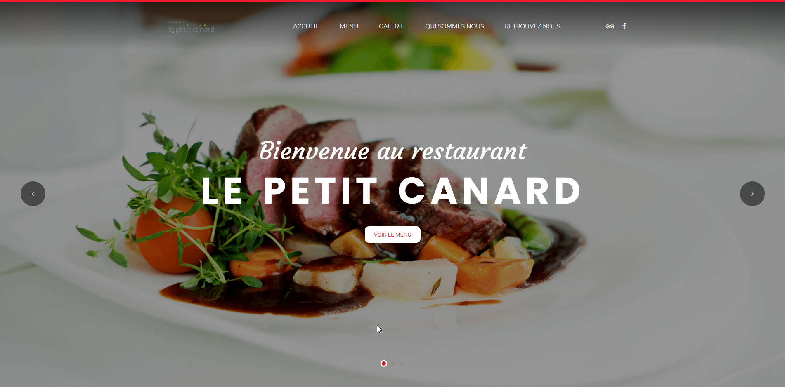

# Projet Bootstrap

Lien: https://github.com/Nouuu/Projet_boostrap

Projet de début de première année, le but étant de faire la refonte d'un site vitrine présent sur le web à l'aide du framework CSS Bootstrap

**Table des matières :**

<!-- toc -->

- [Pour commencer](#pour-commencer)
- [Résultat final](#résultat-final)
- [Auteurs](#auteurs)
- [Ressources utilisées](#ressources-utilisées)

<!-- tocstop -->

# Pour commencer

Nous devions alors trouver un site sur le web.
Notre choix est tombé sur ce site : 

[https://www.resto-lepetitcanard.com/](https://www.resto-lepetitcanard.com/)

# Résultat final

Le projet était assez court et nous étions novice. Nous avons donc utilisé un Template Bootstrap gratuit et nous l'avons calqué sur ce site en faisant bien attention à garder tout les informations du site original !

Le résultat final nous convenait très bien et nous avons vraiment pu apprendre à maitriser le framework CSS Bootstrap.

Le site site est disponible ici :

[https://nouuu.github.io/Projet_boostrap/](https://nouuu.github.io/Projet_boostrap/)

|  |  |
| ------------------------------------------------------------ | ------------------------------------------------------------ |
|  |  |

# Auteurs

Nous étions 3 à réaliser ce projet, dont :

|                                                  |                                                           |
| :----------------------------------------------- | :-------------------------------------------------------: |
| [Swann HERRERA](https://github.com/SwannHERRERA) |  |
| [Noé LARRIEU-LACOSTE](https://github.com/Nouuu)  |         |

# Ressources utilisées

- Framework Bootstrap : [https://getbootstrap.com/](https://getbootstrap.com/)
- Template Eatery : [https://colorlib.com/wp/template/eatery/](https://colorlib.com/wp/template/eatery/)

